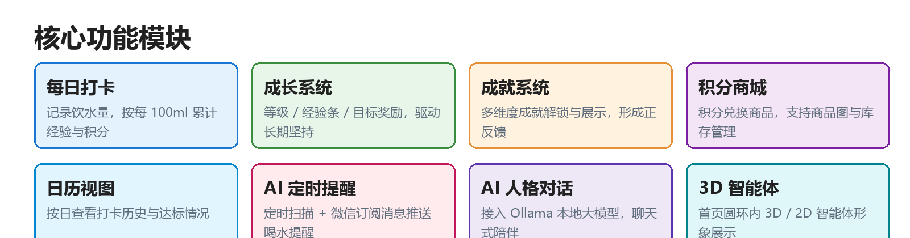
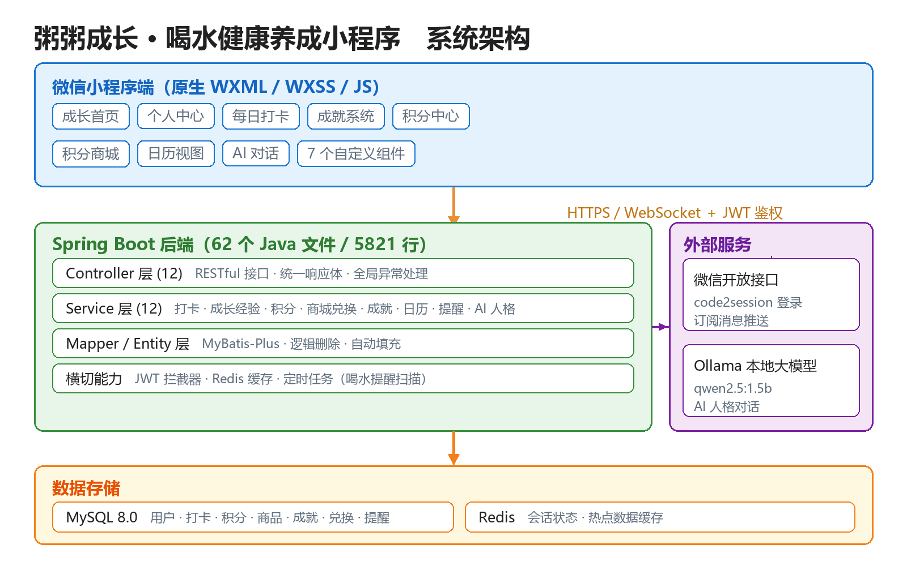

# 粥粥成长 · 喝水健康养成小程序

<p align="center">
  
</p>

把「喝水打卡」做成长期养成体验的全栈项目：**微信小程序前端 + Spring Boot 后端**。

用户记录每日饮水量，系统按水量累计经验与积分，通过等级成长、成就解锁、积分商城、日历回顾与 AI 陪伴，把一件枯燥的小事变成能坚持下去的习惯。

## 核心功能

| 模块 | 说明 |
|---|---|
| 每日打卡 | 记录饮水量，按每 100ml 累计经验与积分，支持达标奖励 |
| 成长系统 | 等级 / 经验条 / 多级经验阈值，驱动长期坚持 |
| 成就系统 | 多维度成就解锁与展示，形成正反馈 |
| 积分商城 | 积分兑换商品，支持商品图、库存与兑换记录 |
| 日历视图 | 按日查看打卡历史与达标情况 |
| AI 定时提醒 | 定时任务扫描 + 微信订阅消息推送喝水提醒 |
| AI 人格对话 | 接入 Ollama 本地大模型（qwen2.5:1.5b），聊天式陪伴 |
| 3D 智能体 | 首页圆环内的 3D / 2D 智能体形象（GLB 模型可选） |

## 系统架构

<p align="center">
  
</p>

## 技术栈

**小程序端**
- 微信小程序原生框架（WXML / WXSS / JavaScript）
- 分包加载（subpackages）降低首屏体积
- 7 个自定义组件：`agent-3d`、`agent-shell`、`chat-card`、`exp-bar`、`goods-card`、`progress-ring`、`quick-checkin`

**后端**
- Spring Boot 2.7.18（Java 8）
- MyBatis-Plus 3.5.3.1（逻辑删除、字段自动填充）
- MySQL 8.0 · Redis
- JWT（jjwt 0.9.1）鉴权 + 登录拦截器
- 定时任务：喝水提醒扫描（cron 可配置）
- 微信开放能力：`code2session` 登录、订阅消息推送

**AI**
- Ollama 本地部署（`qwen2.5:1.5b`），另提供 `mock` 模式用于无模型环境降级

## 目录结构

```
water_app/
├── app.js / app.json / app.wxss       # 小程序全局入口与配置
├── pages/                             # 主包页面（成长首页、个人中心）
├── packageOther/                      # 分包页面（成就 / 积分 / 商城 / 日历 / 打卡 / AI 对话）
├── components/                        # 7 个自定义组件（含 3D 智能体）
├── images/                            # 图片资源
├── utils/                             # 请求封装与通用工具
├── models/ · packageModels/           # 模型资源（GLB 模型占位目录）
├── backend/                           # Spring Boot 后端
│   ├── src/main/java/com/waterapp/    # controller / service / mapper / entity / config / task ...
│   ├── src/main/resources/            # application.yml（凭据一律走环境变量）
│   └── database/                      # 建表与迁移脚本
└── docs/development-notes/            # 开发笔记（需求 / 规划 / 部署 / 排查记录）
```

## 快速开始

### 前置要求

- 微信开发者工具
- JDK 8、Maven 3.6+
- MySQL 8.0；Redis 6+（本地开发需要，云端 profile 已禁用）

### 1. 初始化数据库

```bash
mysql -u root -p -e "CREATE DATABASE water_app DEFAULT CHARSET utf8mb4;"
mysql -u root -p water_app < backend/database/init.sql
mysql -u root -p water_app < backend/database/init_goods.sql   # 可选：商品初始数据
```

### 2. 配置环境变量

后端凭据**不写在代码里**，全部通过环境变量注入：

| 变量 | 说明 | 示例 |
|---|---|---|
| `MYSQL_ADDRESS` | 数据库地址 | `localhost:3306` |
| `MYSQL_USERNAME` | 数据库账号 | `root` |
| `MYSQL_PASSWORD` | 数据库密码 | `your-password` |
| `REDIS_HOST` / `REDIS_PORT` / `REDIS_PASSWORD` | Redis 连接 | `localhost` / `6379` / 空 |
| `JWT_SECRET` | JWT 签名密钥 | 自定义长随机串 |
| `WECHAT_APPID` / `WECHAT_SECRET` | 小程序 AppID / AppSecret | 微信公众平台获取 |
| `WECHAT_TEMPLATE_ID` | 订阅消息模板 ID | 微信公众平台创建 |
| `OLLAMA_BASE_URL` | Ollama 地址（可选） | `http://localhost:11434` |

> 本地开发也可以新建 `backend/src/main/resources/application-local.yml` 覆写配置，该文件已在 `.gitignore` 中忽略。

### 3. 启动后端

```bash
cd backend
mvn spring-boot:run
# 服务地址：http://localhost:8080/api
```

云端部署（微信云托管）使用 `cloud` profile：`application-cloud.yml` 已把数据源、JWT、微信凭据全部改为环境变量占位。

### 4. 启动小程序

用微信开发者工具导入项目根目录，将 `project.config.json` 中的 `appid` 替换为你自己的小程序 AppID，编译即可预览。

## 数据模型（核心表）

`user` · `checkin_record` · `points_record` · `goods` · `exchange_record` · `achievement` · `achievement_config` · `reminder_log` · `reward_reminder` · `user_reminder_setting` · `chat_record`

## 文档

开发过程中的需求、规划、部署与排查记录统一收在 [`docs/development-notes`](docs/development-notes/) 目录。

## 安全说明

- 仓库内**不包含任何真实凭据**：数据库密码、小程序 AppSecret、JWT 密钥等一律通过环境变量注入
- 本地运行时请自行配置环境变量或 `application-local.yml`（已被 `.gitignore` 忽略）

## 已知限制

- 首页 3D 智能体需要自备 `agent_default.glb` 放入 `packageModels/glb/`，缺省时自动降级为 2D 形象
- AI 对话在未部署 Ollama 的环境下会自动切到 `mock` 模式
- 为压缩主包体积，非 TabBar 页面统一放在 `packageOther` 分包下；`pages/` 仅保留两个主包 Tab 页（`home` / `profile`）

## License

MIT
